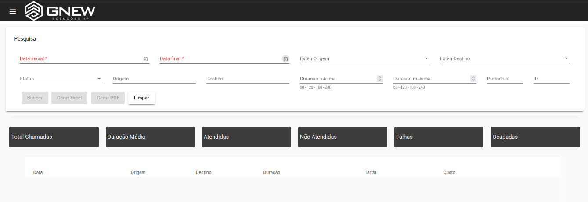
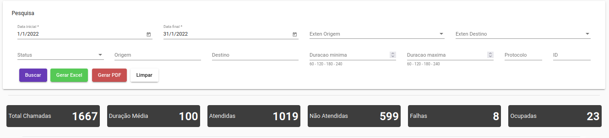
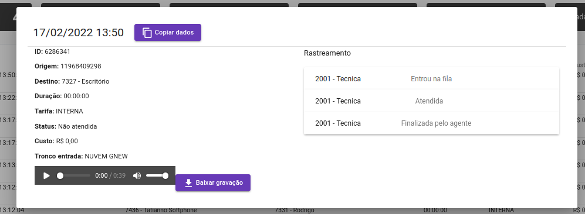
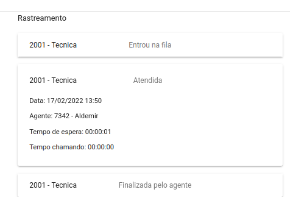

## Ao logar na ferramenta temos o primeiro menu:

Nessa tela podemos ver alguns campos para ser preenchidos onde: 

**Data Inicial:** Dia inicial para puxar os relatórios. 

**Data Final:** Dia final para puxar os relatórios. 

**Exten Origem:** Podemos filtrar por um ramal especifico que originou (que fez) a chamada. 

**Exten Destino:** Podemos filtrar por um ramal especifico que teve como destino (que recebeu) a chamada.

**Status:** Podemos filtrar por somente chamadas: Atendidas, Ocupadas, Não Atendidas, Abandonadas ou todas.

**Origem:** Podemos fazer um filtro pelo número de algum cliente. Exemplo: Imagine que você precisa achar uma gravação de um cliente que ligou mês passado, porém você não sabe o dia que ele ligou entretanto você sabe o número do cliente. Nesse caso é só fazer o filtro no campo “origem” e inserir o número do seu cliente e fazer a busca.

**Destino:** Esse campo é semelhante o campo de “origem” porem no sentido inverso. Ele representa uma ligação realizada para o número informado na pesquisa. 

**Duração Mínima e Máxima:** Onde é possível escolher algum tempo de duração da chamada.

**Protocolo:** Caso a função protocolo esteja habilitada, podemos fazer a busca pela ligação pelo número do protocolo. (A função protocolo só funciona para ligações de entrada) 

Realizei um filtro do período do dia 01/01 a 31/01. Onde o Gnew me trouxe um resumo das chamadas que foram recebidas e realizadas.

Temos as seguintes informações:

**Total de chamadas:** Número total de chamadas recebidas e realizadas. 
**Duração media:** Tempo médio que durou as ligações. (média em segundos) 
**Atendidas:** Total de chamadas que foram atendidas. 
**Não atendidas:** Total das chamadas que não tiveram atendimento. 
**Falhas:** Total das chamadas que tiveram falha, exemplo: chamadas que o operador discou errado. 
**Ocupadas:** Total das chamadas que o destino não atendeu. 

Mais abaixo temos as informações da chamada individual. Onde podemos ver a data e o horário que ocorreu a chamada, a origem (quem fez a chamada) e o destino (para onde o agente ligou). Temos a duração em segundos da chamada, o tipo da tarifação no caso foi um VC1 (chamada celular local SP) e por fim o custo da chamada. 

Se clicarmos em cima da chamada, teremos mais algumas informações, juntamente com o áudio da ligação. Caso necessário podemos baixar o arquivo. 

Obs: Essa chamada foi uma ligação de saída para um celular. 

Já nesse caso temos uma ligação entrada. Onde ela entrou por uma fila de atendimento.

Se notarmos no canto direito temos um campo de “rastreamento” onde é possível ver todo o caminho da chamada. Desde o atendimento do agente (ramal) até o desligamento.

